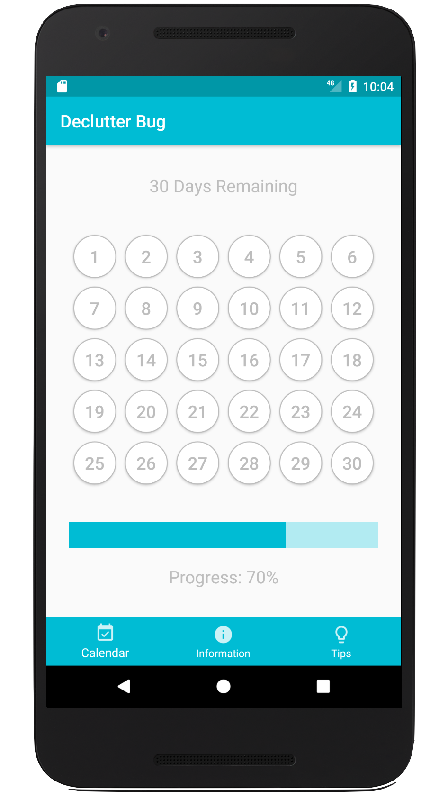
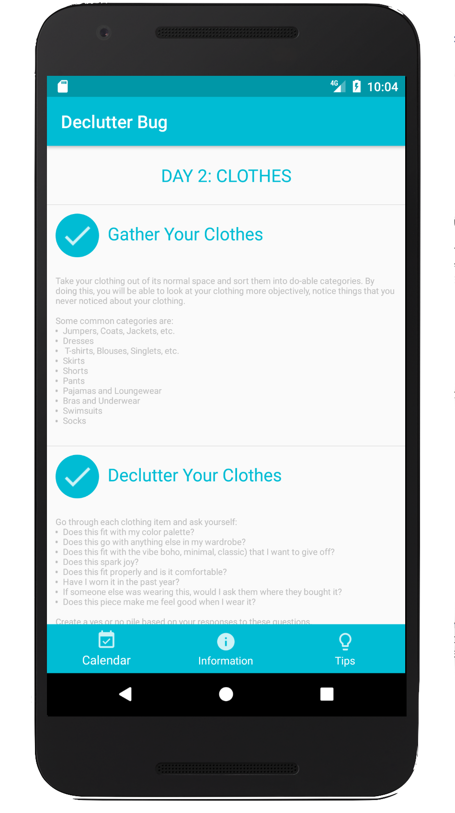

# Declutter-Bug
Declutter Bug is an Android application to declutter your space in 30 days.

By: Aashia Mehta

## Functionalities
## Images

## Notes

This was my first time creating an Android application and I had little experience in Java. My goal for this project was to create an application that looked aesthetically-pleasing and was unique to the market. I learned how to use Android Studio through online tutorials. As someone who is very into minimalism and decluttering, I wanted to help people out by being able to organize their own homes as a 30 day challenge. Recently, I read <i>The Life Changing Magic of Tidying Up</i> and have incorporated MarieKondo’s suggestions about sparking joy in my life by discarding clutter.
